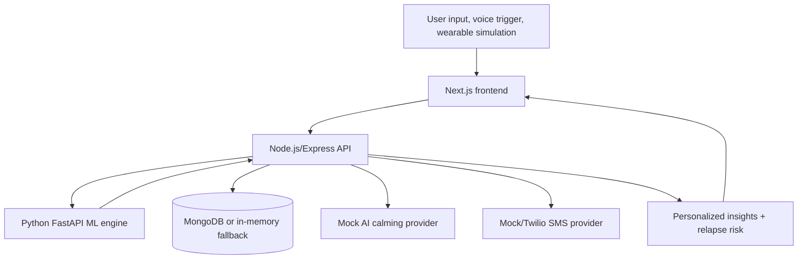

# Anxiety Attack Detector

Anxiety Attack Detector is an AI-assisted full-stack support platform for detecting early anxiety escalation signals, guiding calming interventions, logging episodes, and notifying trusted contacts when risk is high.

This version implements the original roadmap features as active modules using mock or simulated adapters where real paid APIs and device integrations are unavailable.

> Safety: This project is not a medical device, does not diagnose anxiety or panic disorder, and is not a substitute for professional care. For immediate danger, call local emergency services.

## Problem

Anxiety and panic episodes can escalate quickly. Many tools only react after distress is already high. This project combines self-reported symptoms, physiological-style inputs, contextual signals, voice trigger detection, wearable-style readings, and user history to estimate risk earlier and start structured intervention.

The original proposal direction changed from a Flutter/Firebase-style mobile concept to a deployable web monorepo with Next.js, Express, MongoDB, and a Python ML service.

## Key Features

- Manual anxiety episode logging with stress, heart rate, sleep, breathing, trigger, caffeine, mood, chest tightness, dizziness, notes, and optional location.
- Risk score, confidence score, escalation probability, category, explanation, and intervention recommendation.
- Python ML engine with prediction, wearable-risk, voice-stress, relapse-risk, and training endpoints.
- Mock AI calming provider that returns supportive breathing and grounding guidance without an API key.
- Emergency flow with location payloads, contact alerts, primary contact call prompt, and emergency services prompt.
- Mock SMS provider when Twilio is not configured.
- Simulated Apple Watch, Fitbit, and Samsung Health wearable adapters.
- Voice trigger phrase detection and simulated voice stress feature extraction.
- Personalized adaptation from episode history, trigger patterns, wearable anomalies, and baseline comparisons.
- Relapse/repeat-episode risk model for a 24-72 hour window.
- JWT authentication, bcrypt password hashing, protected API routes, rate limiting, CORS, and Helmet headers.
- Docker Compose setup for frontend, backend, ML engine, and MongoDB.

## Tech Stack

| Layer | Technology |
| --- | --- |
| Frontend | Next.js, React, TypeScript, CSS modules/global CSS |
| Backend | Node.js, Express, JWT, bcrypt, Zod-ready validation, Helmet, rate limiting |
| Database | MongoDB with Mongoose models; in-memory fallback for local demo without Mongo |
| ML Engine | Python, FastAPI, NumPy/Pandas/Scikit-learn-ready deterministic models |
| AI | Mock AI provider; adapter-ready OpenAI/Gemini configuration |
| Notifications | Mock SMS provider; Twilio-ready environment variables |
| Wearables | Simulated Apple Watch, Fitbit, Samsung Health adapters |
| Voice | Browser-compatible transcript flow, trigger phrase matching, simulated acoustic scoring |
| DevOps | Docker, Docker Compose, Makefile, GitHub Actions |

## Architecture



## Documentation And Diagrams

- [Architecture notes](docs/architecture.md)
- [Emergency flow](docs/emergency_flow.md)
- [AI model methodology](docs/ai_model_methodology.md)
- [Wearable integration](docs/wearable_integration.md)
- [Voice detection](docs/voice_detection.md)
- [Privacy and HIPAA notes](docs/privacy_and_hipaa_notes.md)
- [Deployment guide](docs/deployment_guide.md)
- [Testing guide](docs/testing_guide.md)
- [Limitations and disclaimer](docs/limitations_and_disclaimer.md)
- [Resume bullets](docs/resume_bullets.md)
- [System architecture diagram](diagrams/system_architecture.md)
- [Emergency sequence flow](diagrams/emergency_sequence_flow.md)
- [ML pipeline flow](diagrams/ml_pipeline_flow.md)
- [Wearable data flow](diagrams/wearable_data_flow.md)
- [Deployment flow](diagrams/deployment_flow.md)

## Real vs Simulated

| Module | Status |
| --- | --- |
| Episode logging, JWT auth, protected routes, risk scoring API | Implemented locally |
| MongoDB models | Implemented; app also runs with in-memory fallback |
| Python ML engine | Implemented with deterministic/synthetic scoring |
| Mock AI calming provider | Implemented and used when no OpenAI/Gemini key exists |
| Mock SMS provider | Implemented and used when Twilio is not configured |
| Twilio SMS adapter | Environment-ready; production credentials required |
| Apple Watch/Fitbit/Samsung adapters | Simulated adapters implemented |
| Voice trigger | Implemented via transcript phrase matching |
| Voice stress extraction | Simulated acoustic feature scoring |
| Personalized adaptation | Implemented from logged history |
| Relapse-risk model | Implemented deterministic 24-72 hour model |

## Folder Structure

```text
.
|-- backend/              # Express API, services, models, tests
|-- frontend/             # Next.js app routes and UI
|-- ml-engine/            # FastAPI ML engine and tests
|-- docs/                 # Architecture, privacy, deployment, testing notes
|-- diagrams/             # Mermaid architecture and flow diagrams
|-- shared/               # API contracts and data dictionary
|-- scripts/              # Local dev and cleanup helpers
|-- docker-compose.yml
|-- Makefile
|-- .env.example
`-- README.md
```

## Local Setup

Prerequisites:

- Node.js 22+
- Python 3.11+
- MongoDB optional for local development

```bash
Copy-Item .env.example .env -Force
npm run install:all
python -m pip install -r ml-engine/requirements.txt
npm run dev
```

Local URLs:

- Frontend: http://localhost:3000
- Backend health: http://localhost:5000/api/health
- ML health: http://localhost:8000/health
- MongoDB: localhost:27017

Individual services:

```bash
npm run client
npm run server
npm run ml
```

## Docker Setup

```bash
docker-compose up --build
```

Stop containers:

```bash
docker-compose down
```

Optional Makefile aliases, if `make` is installed:

```bash
make docker-up
make docker-down
```

## API Endpoints

Base URL: `http://localhost:5000/api`

| Method | Endpoint | Description |
| --- | --- | --- |
| GET | `/health` | Backend status and mock provider status |
| POST | `/auth/register` | Register user and return JWT |
| POST | `/auth/login` | Login and return JWT |
| GET | `/me` | Current authenticated user |
| POST | `/contacts` | Create emergency contact |
| GET | `/contacts` | List emergency contacts |
| POST | `/predict` | Generate risk score without creating an episode |
| POST | `/episodes` | Create episode, prediction, and AI response |
| GET | `/episodes` | List user episodes |
| GET | `/history` | Episode, prediction, wearable, voice, and emergency history |
| POST | `/calm` | Generate calming guidance |
| POST | `/emergency/start` | Log emergency flow start |
| POST | `/emergency/notify` | Send mock/Twilio SMS to contacts |
| POST | `/wearables/simulate` | Generate simulated Apple/Fitbit/Samsung reading |
| POST | `/wearables/analyze` | Analyze wearable reading |
| POST | `/voice/analyze` | Detect trigger phrase and score simulated voice stress |
| GET | `/insights/personalized` | Personalized trigger and prevention insights |
| GET | `/insights/relapse-risk` | 24-72 hour relapse/repeat-risk estimate |

ML engine base URL: `http://localhost:8000`

| Method | Endpoint | Description |
| --- | --- | --- |
| GET | `/health` | ML service status |
| POST | `/predict` | Risk prediction |
| POST | `/train` | Generate synthetic datasets / training response |
| POST | `/predict-relapse` | Relapse risk prediction |
| POST | `/voice-stress` | Simulated voice stress scoring |
| POST | `/wearable-risk` | Wearable anomaly/risk scoring |

Example prediction request:

```json
{
  "stressLevel": 8,
  "heartRate": 118,
  "sleepQuality": 3,
  "breathingIrregularity": true,
  "triggerEvent": true,
  "triggerType": "crowded place",
  "caffeineIntake": 2,
  "chestTightness": 7,
  "dizziness": 5,
  "mood": "anxious"
}
```

## Testing Commands

```bash
npm run test:server
npm run check:server
npm run test:client
npm run test:ml
npm run lint
npm run build
npm run clean
```

Optional Makefile aliases, if `make` is installed:

```bash
make test
make test-server
make test-client
make test-ml
make lint
make build
make clean
```

## Screenshots / Placeholders

Add screenshots after running the app locally:

- `docs/screenshots/landing.png` - landing page and module overview
- `docs/screenshots/dashboard.png` - risk and trigger trends
- `docs/screenshots/episode.png` - episode form and prediction result
- `docs/screenshots/wearables.png` - simulated wearable adapter output
- `docs/screenshots/voice.png` - voice trigger analysis
- `docs/screenshots/emergency.png` - mock SMS emergency flow

## Deployment Notes

- Vercel frontend: deploy `frontend/`, set `NEXT_PUBLIC_API_URL` to the deployed backend URL and `NEXT_PUBLIC_ML_API_URL` if exposing ML directly.
- Render/Railway backend: deploy the root repo, start with `node backend/src/server.js`, configure `PORT`, `MONGO_URI`, `JWT_SECRET`, `CLIENT_URL`, `ML_ENGINE_URL`, and provider secrets.
- Render/Railway ML engine: start with `uvicorn app.main:app --app-dir ml-engine --host 0.0.0.0 --port $PORT`.
- MongoDB Atlas: create a cluster, allow the backend host, create a least-privilege database user, and set `MONGO_URI`.
- Docker/AWS: use `docker-compose.yml` for local orchestration or build separate images for ECS/EC2. Use AWS Secrets Manager or SSM Parameter Store for secrets.

## Privacy And Safety

- This app is not a medical device.
- It does not diagnose anxiety, panic disorder, or any health condition.
- AI calming responses are supportive only.
- Wearable and voice scores are estimates and may be inaccurate.
- User anxiety logs, location, medical notes, and emergency contact details should be treated as sensitive data.
- Production use requires HTTPS, strong secrets, database access controls, deletion/export workflows, logging review, and legal/privacy review.
- HIPAA compliance is not claimed.

## Resume-Ready Bullets

Anxiety Attack Detector  
Personal Project | Next.js, Node.js, MongoDB, Python, Scikit-learn, JWT, Docker

- Built AI-assisted anxiety monitoring platform with manual, voice-triggered, and biometric-style risk detection workflows.
- Developed ML risk scoring engine using behavioral, physiological, and contextual features to classify anxiety escalation risk.
- Integrated emergency response flow with calming guidance, mock/Twilio SMS alerts, location display, and contact escalation prompts.
- Created historical insights dashboard to track risk trends, recurring triggers, wearable anomalies, and relapse-risk indicators.
- Designed modular wearable, voice-stress, and AI-calming adapters to support Apple Watch/Fitbit-style integrations and future clinical review.

## Implemented Planned Modules

The original planned wearable, voice, personalized adaptation, and relapse-risk modules are implemented in this version using simulated adapters and modular interfaces.

## What Still Needs Production Setup

- Real OpenAI or Gemini credentials for live AI calming responses.
- Real Twilio credentials and verified sender number for SMS.
- Real Apple Health, Fitbit, and Samsung Health developer integrations, OAuth consent, and data permissions.
- Production MongoDB Atlas database and backups.
- Production secret management, HTTPS, monitoring, and audit logging.
- Legal, privacy, and clinical review before any real health deployment.
