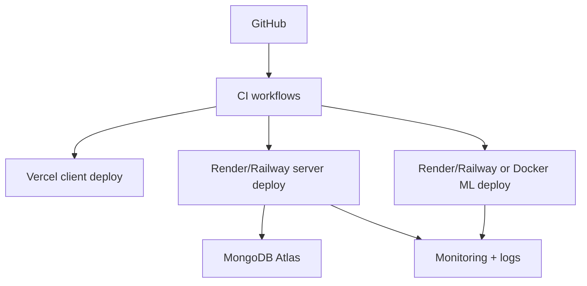

# Deployment Flow

```mermaid
flowchart TD
  GitHub[GitHub]
  CI[CI workflows]
  Client[Vercel client deploy]
  Server[Render/Railway server deploy]
  ML[Render/Railway or Docker ML deploy]
  Atlas[MongoDB Atlas]
  Logs[Monitoring + logs]

  GitHub --> CI
  CI --> Client
  CI --> Server
  CI --> ML
  Server --> Atlas
  ML --> Logs
  Server --> Logs
```
