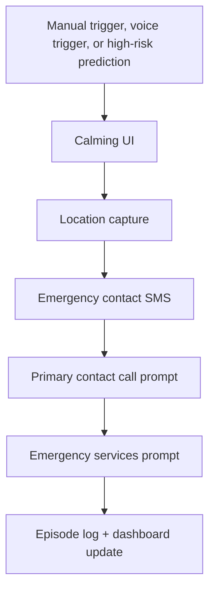

# Emergency Sequence Flow

```mermaid
flowchart TD
  Trigger[Manual trigger, voice trigger, or high-risk prediction]
  Calm[Calming UI]
  Location[Location capture]
  SMS[Emergency contact SMS]
  Call[Primary contact call prompt]
  Services[Emergency services prompt]
  Log[Episode log + dashboard update]

  Trigger --> Calm --> Location --> SMS --> Call --> Services --> Log
```
