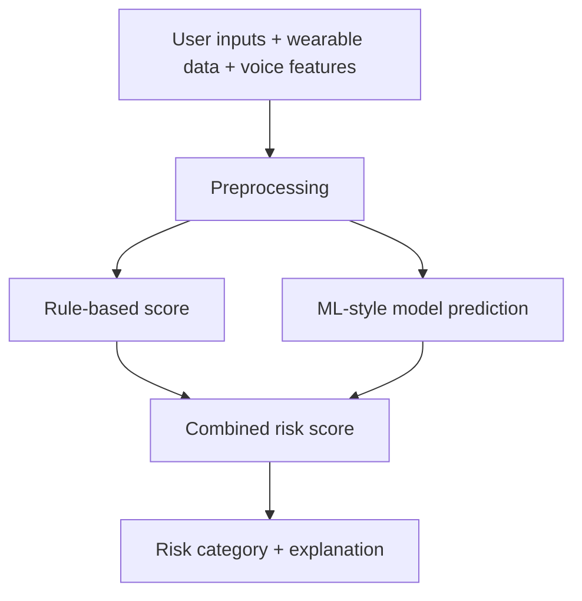

# ML Pipeline Flow

```mermaid
flowchart TD
  Inputs[User inputs + wearable data + voice features]
  Preprocess[Preprocessing]
  Rules[Rule-based score]
  Model[ML-style model prediction]
  Combined[Combined risk score]
  Output[Risk category + explanation]

  Inputs --> Preprocess
  Preprocess --> Rules
  Preprocess --> Model
  Rules --> Combined
  Model --> Combined
  Combined --> Output
```
