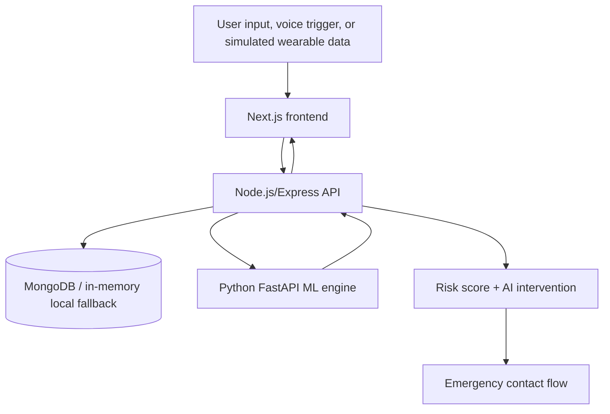

# System Architecture

```mermaid
flowchart TD
  User[User input, voice trigger, or simulated wearable data]
  Client[Next.js frontend]
  API[Node.js/Express API]
  Mongo[(MongoDB / in-memory local fallback)]
  ML[Python FastAPI ML engine]
  Interventions[Risk score + AI intervention]
  Emergency[Emergency contact flow]

  User --> Client --> API
  API --> Mongo
  API --> ML
  ML --> API
  API --> Interventions --> Emergency
  API --> Client
```
