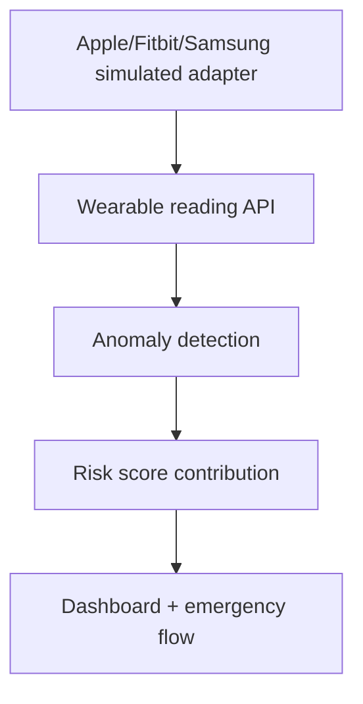

# Wearable Data Flow

```mermaid
flowchart TD
  Adapter[Apple/Fitbit/Samsung simulated adapter]
  API[Wearable reading API]
  Anomaly[Anomaly detection]
  Risk[Risk score contribution]
  Dashboard[Dashboard + emergency flow]

  Adapter --> API --> Anomaly --> Risk --> Dashboard
```
